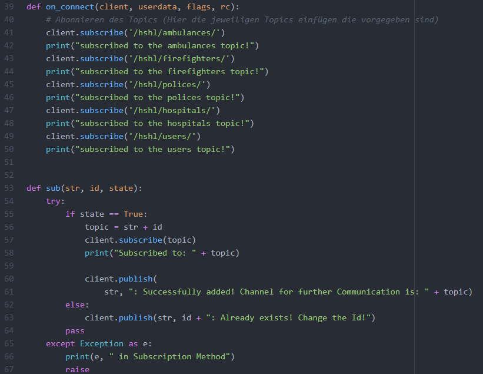
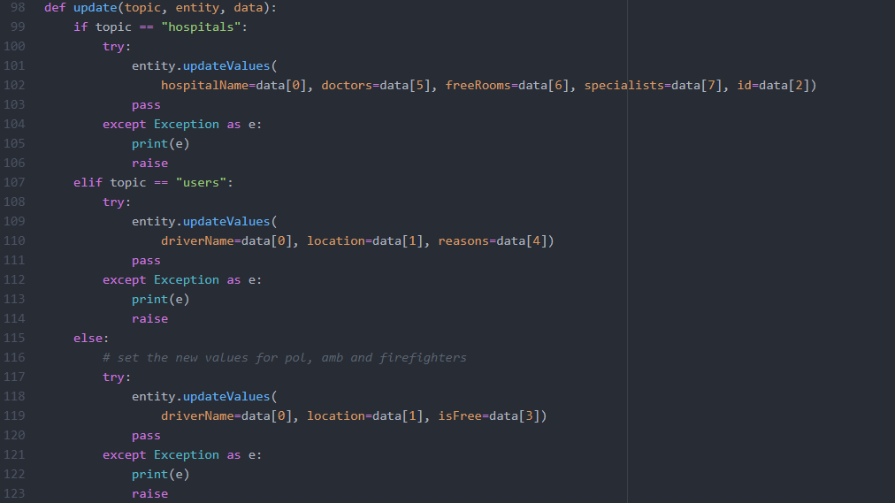
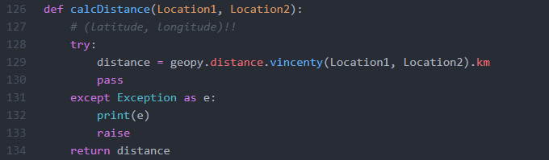
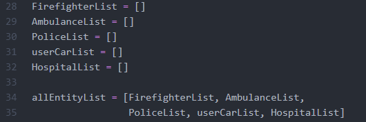
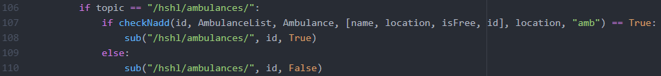
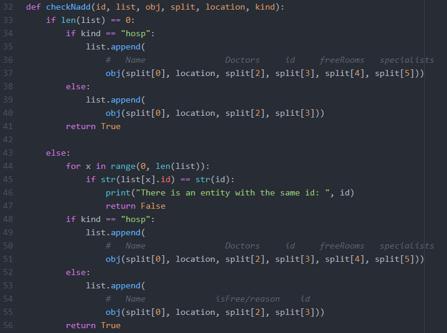
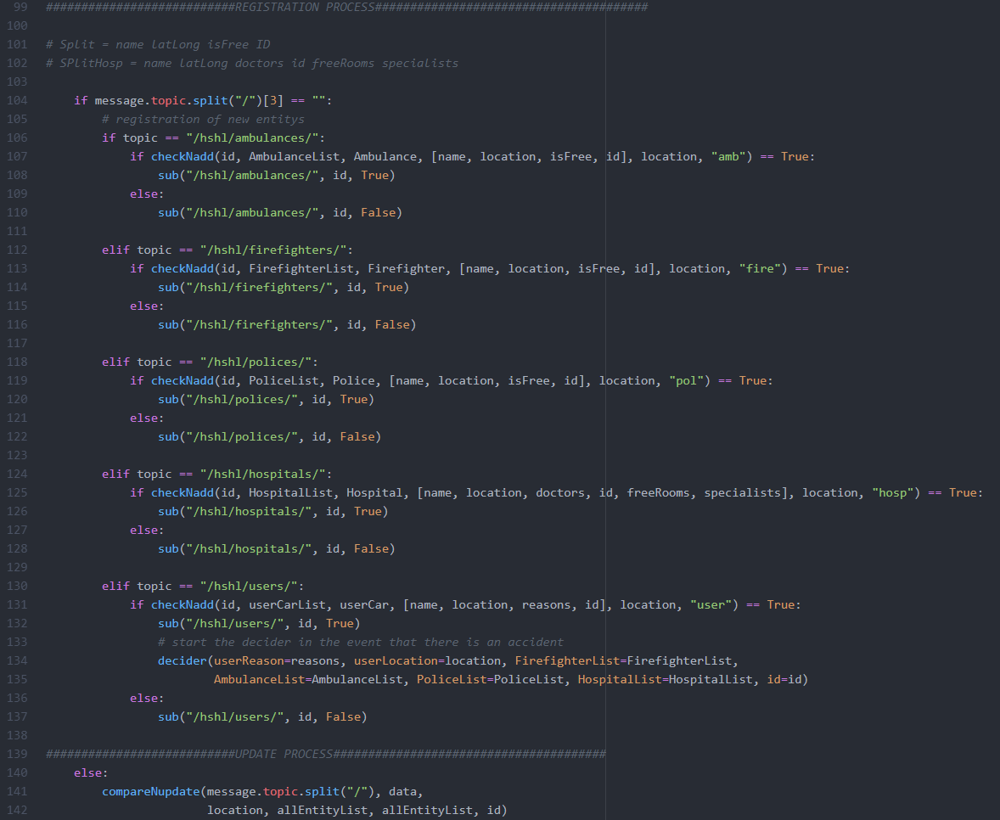

# Requirements

## Functional Requirements DE
FREQ00 - Die Kommunikation muss über definierte Topics stattfinden  
FREQ01 - Die Anwendung muss online verfügbar sein  
FREQ02 - Es muss ein Exception Handling geben  
FREQ03 - Die Anwendung muss Entfernungen berechnen können  
FREQ04 - Die Anwendung muss eine Liste über verfügbare Ressourcen führen  
FREQ05 - Die Anwendung muss situationsbedingt entscheiden können  
FREQ06 - Falsche Anfragen müssen eine Fehlermeldung als Antwort haben  

## Functional Requirements EN
FREQ00 - Communication must take place via defined topics  
FREQ01 - The application must be available online  
FREQ02 - There must be exception handling  
FREQ03 - The application must be able to calculate distances  
FREQ04 - The application must keep a list of available resources  
FREQ05 - The application must be able to decide depending on the situation  
FREQ06 - Wrong requests must have an error message as an answer  

## Non Functional Requirements DE
NFREQ00 - Die Kommunikation muss über ein Protokoll stattfinden  

## Non Functional Requirements EN
NFREQ00 - Communication must take place over a protocol  

## Welche Reuqirements wurden erfüllt

| Requirement | Erfüllt |
| ------ | ------ |
| FREQ00 | Erfüllt |
| FREQ01| Nicht erfüllt |
| FREQ02 | Erfüllt |
| FREQ03 | Erfüllt |
| FREQ04 | Erfüllt |
| FREQ05 | Erfüllt |
| FREQ06 | Nicht erfüllt |
| NFREQ00 | Erfüllt |

### FREQ00
FREQ00 wurde in den Zeilen 39 - 67 in der Datei register.py realisiert.

### FREQ02
FREQ02 wurde an den Stellen realisiert, an denen eine Fehlerhafte Daten Eingabe zum Absturz des Programmes führen würde. Zwei Beispiele aus der Datei manager.py.

### FREQ03
FREQ03 wurde in den Zeilen 126 - 134 in der Datei manager.py realisiert.

### FREQ04
FREQ04 wurde an mehreren stellen im Code implementiert. Angefangen mit der Initialisierung von leeren Listen beim Programm Start. (regiser.py)

 
Am Beispiel des Krankenwagens wird gezeigt das durch die Methode checkNadd der Krankenwagen zur Liste AmbulanceList hinzugefügt wird. (register.py)

 
Die Methode checkNadd zeigt noch einmal deutlich das die Objekte in die dazugehörigen Listen abgelegt werden. (manager.py)

### FREQ05
FREQ05 wurde in Zeile 104 und 140 (quick and dirty) realisiert.

### NFREQ00
Die Kommunikation findet über das MQTT Protokoll statt.
